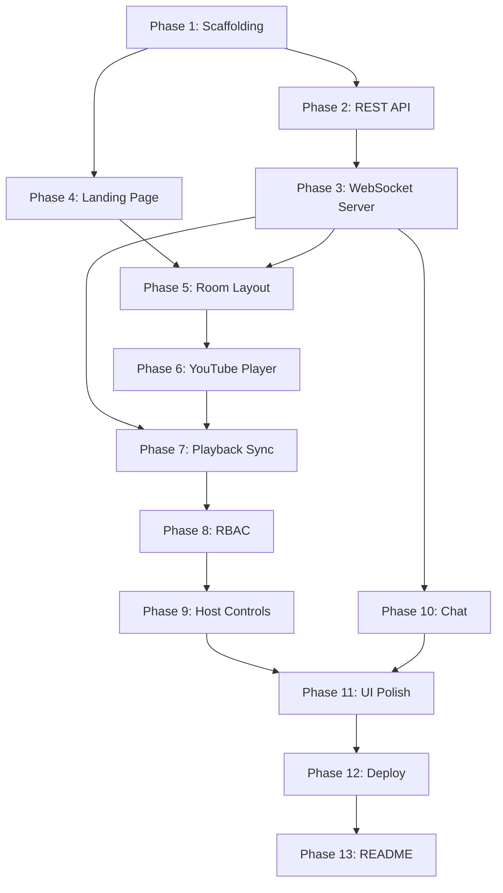

# YouTube Watch Party — Step-by-Step Implementation Plan

A phased, feature-by-feature plan for building a real-time YouTube Watch Party system. Each phase is a **single Git push** — self-contained, testable, and reviewable.

---

## Tech Stack

| Layer | Technology | Why |
|-------|-----------|-----|
| Frontend | React + TypeScript + Vite | Fast dev, type safety, modern tooling |
| Backend | Node.js + Express + TypeScript | Same language as frontend, great Socket.IO support |
| WebSocket | Socket.IO | Built-in rooms, reconnection, fallback transport |
| Database | SQLite (via `better-sqlite3`) | Zero-config, file-based, perfect for MVP |
| Video | YouTube IFrame Player API | Official API, full playback control |
| Styling | Vanilla CSS + CSS Variables | Full control, premium design system |

---

## Phase Overview

| # | Feature | Git Commit Message | Complexity |
|---|---------|-------------------|------------|
| 1 | Project Scaffolding | `feat: initialize monorepo with client and server` | ⭐ |
| 2 | Backend REST API — Room CRUD | `feat: add room creation and join API endpoints` | ⭐⭐ |
| 3 | WebSocket Server — Core Events | `feat: add Socket.IO server with join/leave room events` | ⭐⭐ |
| 4 | Frontend — Landing Page | `feat: add landing page with create/join room UI` | ⭐⭐ |
| 5 | Frontend — Room Page Layout | `feat: add room page with participant sidebar` | ⭐⭐ |
| 6 | YouTube Player Integration | `feat: integrate YouTube IFrame API with player controls` | ⭐⭐⭐ |
| 7 | Real-time Playback Sync | `feat: sync play/pause/seek/change-video across clients` | ⭐⭐⭐⭐ |
| 8 | Role-Based Access Control | `feat: add RBAC with Host/Moderator/Participant roles` | ⭐⭐⭐ |
| 9 | Host Management Controls | `feat: add assign role, remove participant, transfer host` | ⭐⭐⭐ |
| 10 | Real-time Chat | `feat: add in-room text chat via WebSocket` | ⭐⭐ |
| 11 | UI Polish & Responsive Design | `feat: add dark theme, animations, and responsive layout` | ⭐⭐ |
| 12 | Deployment to Render | `feat: add deployment config and production build` | ⭐⭐ |
| 13 | README & Documentation | `docs: add README with setup, architecture, and live URL` | ⭐ |

---

## Phase 1: Project Scaffolding

**Goal:** Set up the monorepo structure with both client and server apps that run independently.

**Commit:** `feat: initialize monorepo with client and server`

### Directory Structure
```
youtube-watch-party/
├── client/                  # React + Vite frontend
│   ├── src/
│   │   ├── main.tsx
│   │   ├── App.tsx
│   │   ├── index.css
│   │   └── vite-env.d.ts
│   ├── index.html
│   ├── package.json
│   ├── tsconfig.json
│   └── vite.config.ts
├── server/                  # Express + Socket.IO backend
│   ├── src/
│   │   ├── index.ts
│   │   └── config.ts
│   ├── package.json
│   └── tsconfig.json
├── package.json             # Root workspace package.json
├── .gitignore
└── README.md
```

### Steps
1. Create root `package.json` with npm workspaces: `"workspaces": ["client", "server"]`
2. Scaffold client with `npx create-vite client --template react-ts`
3. Initialize server with Express + TypeScript:
   - Dependencies: `express`, `cors`, `dotenv`, `socket.io`
   - Dev deps: `typescript`, `ts-node-dev`, `@types/express`, `@types/cors`
4. Create `server/src/index.ts` — basic Express server on port `3001` with a health check route `GET /api/health`
5. Create root `.gitignore` (node_modules, dist, .env, *.db)
6. Add root scripts:
   ```json
   "scripts": {
     "dev:client": "npm run dev --workspace=client",
     "dev:server": "npm run dev --workspace=server",
     "dev": "concurrently \"npm run dev:server\" \"npm run dev:client\""
   }
   ```
7. Install `concurrently` as a root dev dependency

### Verification
- `npm run dev:server` → Server running on `http://localhost:3001`
- `npm run dev:client` → Vite dev server on `http://localhost:5173`
- `GET http://localhost:3001/api/health` → `{ "status": "ok" }`

---

## Phase 2: Backend REST API — Room CRUD

**Goal:** Create REST endpoints for creating and joining rooms, with an in-memory store (upgrade to SQLite later).

**Commit:** `feat: add room creation and join API endpoints`

### New Files
```
server/src/
├── models/
│   └── Room.ts              # Room class (OOP)
├── models/
│   └── Participant.ts       # Participant class (OOP)
├── store/
│   └── RoomStore.ts         # In-memory room storage
├── routes/
│   └── roomRoutes.ts        # Express router for /api/rooms
└── utils/
    └── generateId.ts        # Room code generator (6-char alphanumeric)
```

### Room Class (OOP)
```typescript
class Room {
  id: string;
  code: string;          // 6-char join code
  hostId: string;
  participants: Map<string, Participant>;
  videoState: {
    videoId: string | null;
    isPlaying: boolean;
    currentTime: number;
    lastUpdated: number;
  };
  createdAt: Date;
}
```

### Participant Class (OOP)
```typescript
class Participant {
  id: string;
  username: string;
  role: 'host' | 'moderator' | 'participant';
  socketId: string | null;
  joinedAt: Date;
}
```
### API Endpoints
| Method | Endpoint | Body | Response |
|--------|----------|------|----------|
| `POST` | `/api/rooms` | `{ username }` | `{ roomId, roomCode, participantId, role: "host" }` |
| `POST` | `/api/rooms/join` | `{ roomCode, username }` | `{ roomId, participantId, role: "participant" }` |
| `GET`  | `/api/rooms/:roomId` | — | `{ room details, participants }` |

### Verification
- Use Postman/curl to create a room → get back roomCode
- Join room with roomCode → get back participantId
- GET room details → see both participants listed

---

## Phase 3: WebSocket Server — Core Events

**Goal:** Add Socket.IO server with room-based WebSocket connections, join/leave events, and participant broadcasting.

**Commit:** `feat: add Socket.IO server with join/leave room events`

### New Files
```
server/src/
├── socket/
│   ├── socketServer.ts      # Socket.IO initialization & middleware
│   ├── handlers/
│   │   └── roomHandler.ts   # join_room, leave_room event handlers
│   └── middleware/
│       └── authMiddleware.ts # Validate participantId on connection
```

### WebSocket Events Implemented
| Event | Direction | Payload | Action |
|-------|-----------|---------|--------|
| `join_room` | Client → Server | `{ roomId, participantId }` | Join Socket.IO room, broadcast `user_joined` |
| `leave_room` | Client → Server | `{ roomId }` | Leave Socket.IO room, broadcast `user_left` |
| `user_joined` | Server → Room | `{ username, participantId, role, participants[] }` | Notify all in room |
| `user_left` | Server → Room | `{ username, participantId, participants[] }` | Notify all in room |
| `sync_state` | Server → Client | `{ playState, currentTime, videoId }` | Send current state on join |

### Implementation Details
- Attach Socket.IO to the Express HTTP server
- Use Socket.IO rooms (built-in) for broadcasting to room members
- On `join_room`: validate participantId exists in RoomStore, join Socket.IO room, emit `sync_state` to the new joiner, broadcast `user_joined` to others
- On disconnect: auto-leave room, broadcast `user_left`
- If host disconnects: optionally auto-transfer host to next participant

### Verification
- Open two browser tabs → connect to Socket.IO
- Tab 1 creates room, Tab 2 joins → both see `user_joined` event
- Tab 2 closes → Tab 1 sees `user_left` event

---

## Phase 4: Frontend — Landing Page

**Goal:** Build a beautiful landing page where users can create or join a watch party room.

**Commit:** `feat: add landing page with create/join room UI`

### New Files
```
client/src/
├── pages/
│   └── LandingPage.tsx
├── components/
│   ├── CreateRoomForm.tsx
│   └── JoinRoomForm.tsx
├── services/
│   └── api.ts               # Axios/fetch wrapper for REST API calls
├── styles/
│   └── landing.css
└── types/
    └── index.ts             # Shared TypeScript interfaces
```

### UI Design
- **Dark theme** with gradient background (deep navy → dark purple)
- **Glassmorphic card** centered on page with two tabs: "Create Party" / "Join Party"
- **Create Party tab:** Username input + "Create Room" button → calls `POST /api/rooms`
- **Join Party tab:** Username input + Room Code input + "Join Room" button → calls `POST /api/rooms/join`
- **Animated background:** Subtle floating particles or gradient animation
- **Google Font:** Inter or Outfit for modern typography
- **Logo/title:** "🎬 Watch Party" with glow effect

### Routing
- Install `react-router-dom`
- `/` → LandingPage
- `/room/:roomId` → RoomPage (placeholder for now)
- On successful create/join → redirect to `/room/:roomId` with participantId in state

### Verification
- Landing page renders with polished UI
- Create room → redirects to `/room/xyz` (shows placeholder)
- Join with valid code → redirects to `/room/xyz`
- Join with invalid code → shows error toast

---

## Phase 5: Frontend — Room Page Layout

**Goal:** Build the room page skeleton with a video area, participant sidebar, and controls bar.

**Commit:** `feat: add room page with participant sidebar`

### New Files
```
client/src/
├── pages/
│   └── RoomPage.tsx
├── components/
│   ├── VideoPlayer.tsx       # Placeholder for YouTube player
│   ├── ParticipantList.tsx   # Sidebar showing users + roles
│   ├── ControlsBar.tsx       # Play/Pause/Seek controls (UI only)
│   └── RoomHeader.tsx        # Room code display, copy button, leave button
├── hooks/
│   └── useSocket.ts          # Custom hook for Socket.IO connection
├── context/
│   └── RoomContext.tsx        # React context for room state
└── styles/
    └── room.css
```

### Layout (CSS Grid)
```
┌─────────────────────────────────────────────┐
│  RoomHeader (room code, copy btn, leave)    │
├────────────────────────┬────────────────────┤
│                        │  ParticipantList   │
│    VideoPlayer         │  ┌──────────────┐  │
│    (placeholder)       │  │ 👑 Host       │  │
│                        │  │ 🛡️ Moderator  │  │
│                        │  │ 👤 User3      │  │
│                        │  └──────────────┘  │
├────────────────────────┴────────────────────┤
│  ControlsBar (▶ ⏸ seek bar, URL input)     │
└─────────────────────────────────────────────┘
```

### Socket.IO Connection
- `useSocket` hook: connect on mount, join room, listen for events, disconnect on unmount
- `RoomContext`: store participants, video state, user role, room info
- Display participant list with role badges (crown for host, shield for mod)

### Verification
- Navigate to `/room/:id` → see full layout with sidebar
- Participant list shows current user with correct role badge
- Second user joins → participant list updates in real-time
- User leaves → removed from list

---

## Phase 6: YouTube Player Integration

**Goal:** Embed the YouTube IFrame Player API and wire up basic playback controls.

**Commit:** `feat: integrate YouTube IFrame API with player controls`

### New/Modified Files
```
client/src/
├── components/
│   ├── VideoPlayer.tsx       # YouTube IFrame embed
│   └── ControlsBar.tsx       # Wire up play/pause/seek/change video
├── hooks/
│   └── useYouTubePlayer.ts   # Custom hook for YT player lifecycle
└── utils/
    └── youtube.ts            # Extract videoId from YouTube URL
```

### YouTube IFrame API Integration
1. Load the YouTube IFrame API script dynamically in `index.html` or via a hook
2. Create a `useYouTubePlayer` hook that:
   - Initializes `YT.Player` on a div element
   - Exposes methods: `play()`, `pause()`, `seekTo(seconds)`, `loadVideo(videoId)`
   - Fires callbacks: `onStateChange`, `onReady`
   - Handles player events and maps them to app state
3. **URL input** in ControlsBar: paste YouTube URL → extract videoId → load video

### YouTube URL Parser
```typescript
// Handles: youtube.com/watch?v=XXX, youtu.be/XXX, youtube.com/embed/XXX
function extractVideoId(url: string): string | null { ... }
```

### Controls Bar
- ▶️ Play / ⏸️ Pause toggle button
- Seek slider (current time / duration)
- Video URL input field + "Load" button
- Current time display: `02:34 / 10:15`
- Controls are **visually present** for all roles but functionally gated later (Phase 8)

### Verification
- Paste a YouTube URL → video loads and plays
- Click play/pause → video responds
- Drag seek bar → video seeks
- Change URL → new video loads

---

## Phase 7: Real-time Playback Synchronization

**Goal:** When host/moderator controls playback, all room participants see the same action in real time.

**Commit:** `feat: sync play/pause/seek/change-video across clients`

### New/Modified Files
```
server/src/
├── socket/handlers/
│   └── playbackHandler.ts   # play, pause, seek, change_video handlers
client/src/
├── hooks/
│   └── usePlaybackSync.ts   # Hook to send/receive playback events
```

### WebSocket Events
| Event | Direction | Payload | Server Action |
|-------|-----------|---------|---------------|
| `play` | Client → Server | `{ roomId, currentTime }` | Validate role → broadcast `sync_state` with `isPlaying: true` |
| `pause` | Client → Server | `{ roomId, currentTime }` | Validate role → broadcast `sync_state` with `isPlaying: false` |
| `seek` | Client → Server | `{ roomId, time }` | Validate role → broadcast `sync_state` with new `currentTime` |
| `change_video` | Client → Server | `{ roomId, videoId }` | Validate role → broadcast `sync_state` with new `videoId` |
| `sync_state` | Server → Room | `{ isPlaying, currentTime, videoId, timestamp }` | — |

### Sync Logic (Critical)
1. **Server is the source of truth** — Room stores canonical video state
2. On `play`/`pause`/`seek`/`change_video`:
   - Server updates room's `videoState`
   - Server broadcasts `sync_state` to **all** clients in room (including sender)
3. On receiving `sync_state` (client):
   - Compare with local player state
   - If `videoId` changed → load new video
   - If `isPlaying` differs → play or pause
   - If `currentTime` drift > 2 seconds → seek to sync
4. **Prevent echo loops**: Use a flag `isSyncing` to ignore player state changes triggered by incoming sync events
5. **Late joiners**: On `join_room`, server sends current `sync_state` immediately

### Drift Correction
```typescript
// Every 5 seconds, server broadcasts authoritative sync_state
// Clients compare and correct if drift > 2 seconds
setInterval(() => {
  room.broadcast('sync_state', room.videoState);
}, 5000);
```

### Verification
- Open 2 browser tabs in the same room
- Tab 1 plays → Tab 2 auto-plays
- Tab 1 pauses → Tab 2 auto-pauses
- Tab 1 seeks to 1:30 → Tab 2 jumps to 1:30
- Tab 1 changes video → Tab 2 loads new video
- Tab 2 joins late → immediately syncs to current state

---

## Phase 8: Role-Based Access Control

**Goal:** Enforce permissions so only Host and Moderator can control playback. Participants can only watch.

**Commit:** `feat: add RBAC with Host/Moderator/Participant roles`

### New/Modified Files
```
server/src/
├── middleware/
│   └── roleGuard.ts          # Permission validation utility
├── models/
│   └── permissions.ts        # Role → permissions mapping
client/src/
├── components/
│   └── ControlsBar.tsx       # Conditionally disable controls
│   └── ParticipantList.tsx   # Show role badges + context menu
```

### Permission Matrix
| Action | Host | Moderator | Participant |
|--------|------|-----------|-------------|
| Play/Pause | ✅ | ✅ | ❌ |
| Seek | ✅ | ✅ | ❌ |
| Change Video | ✅ | ✅ | ❌ |
| Assign Role | ✅ | ❌ | ❌ |
| Remove Participant | ✅ | ❌ | ❌ |
| Transfer Host | ✅ | ❌ | ❌ |

### Backend Enforcement
```typescript
// roleGuard.ts
function canControlPlayback(role: string): boolean {
  return role === 'host' || role === 'moderator';
}

// In playbackHandler.ts — before processing any event:
if (!canControlPlayback(participant.role)) {
  socket.emit('error', { message: 'Insufficient permissions' });
  return;
}
```

### Frontend Enforcement
- `ControlsBar`: If user role is `participant`, disable all playback buttons and show a subtle message "Only Host and Moderators can control playback"
- `ParticipantList`: Show role badges:
  - 👑 Host (gold badge)
  - 🛡️ Moderator (blue badge)
  - 👤 Participant (gray badge)
- Controls are visually dimmed (reduced opacity, `cursor: not-allowed`) for participants

### Verification
- Host can play/pause/seek/change video → works
- Participant tries to play → button is disabled, server rejects if bypassed
- Moderator can play/pause → works
- Participant sees "Watching mode" indicator

---

## Phase 9: Host Management Controls

**Goal:** Host can assign roles, remove participants, and optionally transfer the host role.

**Commit:** `feat: add assign role, remove participant, transfer host`

### New/Modified Files
```
server/src/
├── socket/handlers/
│   └── managementHandler.ts  # assign_role, remove_participant, transfer_host
client/src/
├── components/
│   ├── ParticipantList.tsx   # Context menu for host actions
│   └── ParticipantCard.tsx   # Individual participant with action dropdown
│   └── RoleAssignModal.tsx   # Modal for role assignment
```

### WebSocket Events
| Event | Direction | Payload | Validation |
|-------|-----------|---------|------------|
| `assign_role` | Client → Server | `{ roomId, targetUserId, role }` | Host only |
| `remove_participant` | Client → Server | `{ roomId, targetUserId }` | Host only |
| `transfer_host` | Client → Server | `{ roomId, targetUserId }` | Host only |
| `role_assigned` | Server → Room | `{ userId, username, newRole, participants[] }` | — |
| `participant_removed` | Server → Room | `{ userId, participants[] }` | — |
| `host_transferred` | Server → Room | `{ newHostId, participants[] }` | — |

### Host Actions (UI)
- **Participant Card** (for host only): Hover/click reveals action dropdown:
  - "Promote to Moderator" / "Demote to Participant"
  - "Remove from Room"
  - "Transfer Host" (with confirmation dialog)
- **Role Assignment**: Changes broadcast immediately, UI updates for all clients
- **Remove Participant**: Target user's socket gets disconnected, they see "You were removed from the room" and redirect to landing page
- **Transfer Host**: Current host becomes Participant, target becomes Host. Confirmation required.

### Edge Cases
- Host leaves without transferring → auto-transfer to longest-present Moderator, or oldest Participant
- Cannot remove yourself (the host)
- Cannot demote yourself from host (use transfer instead)

### Verification
- Host clicks "Promote to Moderator" on a participant → role updates for everyone
- New moderator can now control playback
- Host removes a participant → they are kicked and redirected
- Host transfers host → old host loses controls, new host gains them

---

## Phase 10: Real-time Chat (Bonus)

**Goal:** Add an in-room text chat panel so users can communicate while watching.

**Commit:** `feat: add in-room text chat via WebSocket`

### New/Modified Files
```
server/src/
├── socket/handlers/
│   └── chatHandler.ts       # chat_message handler
client/src/
├── components/
│   ├── ChatPanel.tsx         # Chat sidebar/panel
│   └── ChatMessage.tsx       # Individual message component
└── styles/
    └── chat.css
```

### WebSocket Events
| Event | Direction | Payload |
|-------|-----------|---------|
| `chat_message` | Client → Server | `{ roomId, message }` |
| `chat_broadcast` | Server → Room | `{ username, role, message, timestamp }` |

### UI Design
- Chat panel below or beside participant list (collapsible on mobile)
- Messages show: username, role badge, timestamp, message text
- Input field at bottom with Send button and Enter key support
- Auto-scroll to newest message
- System messages: "[username] joined the room", "[username] left"
- Optional: emoji reactions (🎉 😂 👍) as quick-send buttons

### Verification
- Type message in Tab 1 → appears in Tab 2
- Messages show correct username and role badge
- System messages appear on join/leave

---

## Phase 11: UI Polish & Responsive Design

**Goal:** Make the app look production-ready with dark theme, animations, and mobile responsiveness.

**Commit:** `feat: add dark theme, animations, and responsive layout`

### Design System (CSS Variables)
```css
:root {
  /* Colors — Dark Theme */
  --bg-primary: #0a0a1a;
  --bg-secondary: #12122a;
  --bg-card: rgba(255, 255, 255, 0.05);
  --bg-glass: rgba(255, 255, 255, 0.08);
  --text-primary: #e8e8ff;
  --text-secondary: #8888aa;
  --accent-primary: #6c5ce7;
  --accent-secondary: #a29bfe;
  --accent-glow: rgba(108, 92, 231, 0.3);
  --danger: #ff4757;
  --success: #2ed573;
  --border: rgba(255, 255, 255, 0.1);
  --shadow: 0 8px 32px rgba(0, 0, 0, 0.3);

  /* Typography */
  --font-family: 'Inter', sans-serif;
  --font-size-xs: 0.75rem;
  --font-size-sm: 0.875rem;
  --font-size-md: 1rem;
  --font-size-lg: 1.25rem;
  --font-size-xl: 1.5rem;
  --font-size-2xl: 2rem;

  /* Spacing */
  --radius-sm: 8px;
  --radius-md: 12px;
  --radius-lg: 16px;
  --radius-xl: 24px;

  /* Transitions */
  --transition-fast: 150ms ease;
  --transition-normal: 300ms ease;
  --transition-slow: 500ms ease;
}
```

### Animations & Micro-interactions
- **Page transitions:** Fade-in on route change
- **Button hover:** Scale + glow effect
- **Participant join/leave:** Slide-in / slide-out animation
- **Chat messages:** Fade-in from bottom
- **Video loading:** Skeleton shimmer
- **Room code copy:** Tooltip "Copied!" with checkmark animation
- **Role change:** Flash highlight on participant card
- **Toast notifications:** Slide-in from top-right

### Responsive Breakpoints
- **Desktop (>1024px):** Video + sidebar layout (70/30 split)
- **Tablet (768-1024px):** Video full width, sidebar collapses to bottom drawer
- **Mobile (<768px):** Stacked layout, chat/participants in tabs below video

### Verification
- App looks premium on desktop, tablet, and mobile
- All animations are smooth (60fps)
- Dark theme is consistent across all components
- No layout breaks on any screen size

---

## Phase 12: Deployment to Render

**Goal:** Deploy the full-stack app to Render so it's publicly accessible.

**Commit:** `feat: add deployment config and production build`

### Deployment Architecture (Render)
```
┌──────────────────────────────────────┐
│           Render Platform            │
├──────────────────────────────────────┤
│  Web Service (Node.js)               │
│  ┌─────────────────────┐            │
│  │  Express Server      │            │
│  │  + Socket.IO         │            │
│  │  + Serves React      │  ← Single │
│  │    static files      │    deploy  │
│  └─────────────────────┘            │
│  Port: $PORT (from env)             │
└──────────────────────────────────────┘
```

### Setup Steps
1. **Build script** in root `package.json`:
   ```json
   "build": "npm run build --workspace=client && npm run build --workspace=server"
   ```
2. **Server serves client build**: In production, Express serves `client/dist/` as static files
3. **Environment variables** on Render:
   - `NODE_ENV=production`
   - `PORT` (auto-provided by Render)
4. **Start command**: `npm run start --workspace=server`
5. **render.yaml** (Blueprint):
   ```yaml
   services:
     - type: web
       name: youtube-watch-party
       runtime: node
       buildCommand: npm install && npm run build
       startCommand: npm run start --workspace=server
       envVars:
         - key: NODE_ENV
           value: production
   ```

### Production Considerations
- Set `cors` origin to the Render URL
- Handle WebSocket connections behind Render's proxy
- Add `"engines": { "node": ">=18" }` to package.json
- Create `.env.example` for local development

### Verification
- Push to GitHub → Render auto-deploys
- Visit `https://your-app.onrender.com` → Landing page loads
- Create room on one device, join on another → Full sync works
- WebSocket connection is stable

---

## Phase 13: README & Documentation

**Goal:** Write comprehensive README with architecture overview, setup instructions, and live URL.

**Commit:** `docs: add README with setup, architecture, and live URL`

### README Sections
1. **Title & Badge** — Project name, tech stack badges, live demo link
2. **Features** — Bulleted list of all implemented features
3. **Architecture Overview** — Diagram showing client ↔ WebSocket ↔ Server flow
4. **Tech Stack** — Table of technologies used and why
5. **Getting Started** — Clone, install, run locally (step-by-step)
6. **Environment Variables** — Table of all env vars
7. **WebSocket Events** — Table documenting all events, directions, payloads
8. **Role-Based Access** — Permission matrix
9. **Deployment** — How to deploy to Render
10. **Live Demo** — Public URL
11. **Screenshots** — UI screenshots of key pages

### Architecture Diagram (for README)
```
┌─────────────┐     WebSocket (Socket.IO)     ┌──────────────┐
│   Client A   │ ←─────────────────────────→  │              │
│  (React +    │                               │   Server     │
│   YT Player) │     REST API (Express)        │  (Node.js +  │
├─────────────┤ ←─────────────────────────→  │   Express +  │
│   Client B   │                               │   Socket.IO) │
│  (React +    │     WebSocket (Socket.IO)     │              │
│   YT Player) │ ←─────────────────────────→  │   In-memory  │
├─────────────┤                               │   Room Store │
│   Client C   │     WebSocket (Socket.IO)     │              │
│  (React +    │ ←─────────────────────────→  └──────────────┘
│   YT Player) │
└─────────────┘
```

---

## Execution Order & Dependencies



> [!IMPORTANT]
> **Phases must be done in order.** Each phase depends on previous ones. Push to GitHub after each phase is complete and tested.

---

## User Review Required

> [!WARNING]
> **New Project Location:** This plan creates a NEW project `youtube-watch-party`. It should NOT be built inside your existing portfolio (`d:\portfolio`). Please confirm where you'd like the project directory created (e.g., `d:\youtube-watch-party`).

> [!IMPORTANT]
> **Tech Stack Confirmation:** The plan uses React + Vite + Socket.IO + Express. If you prefer a different stack (e.g., Next.js full-stack, Python/FastAPI backend), please let me know before we start.

> [!NOTE]
> **Database:** The MVP uses in-memory storage. SQLite can be added in a later phase for room persistence. Is that acceptable for your submission?

---

## Verification Plan

### Per-Phase Testing
Each phase includes its own verification checklist (listed above). Before pushing:
1. Run `npm run dev` — both client and server start without errors
2. Test the specific feature manually
3. Check browser console for errors
4. Verify WebSocket events in browser DevTools (Network → WS)

### End-to-End Testing
After Phase 11:
1. Open app in 3 different browser tabs
2. Create room → share code → join from other tabs
3. Test full flow: create → join → play → pause → seek → change video → assign role → remove user → chat
4. Test on mobile (responsive layout)
5. Deploy and repeat on production URL

### Code Quality
- TypeScript strict mode — no `any` types
- Consistent code style
- Meaningful variable and function names
- Comments on complex sync logic
